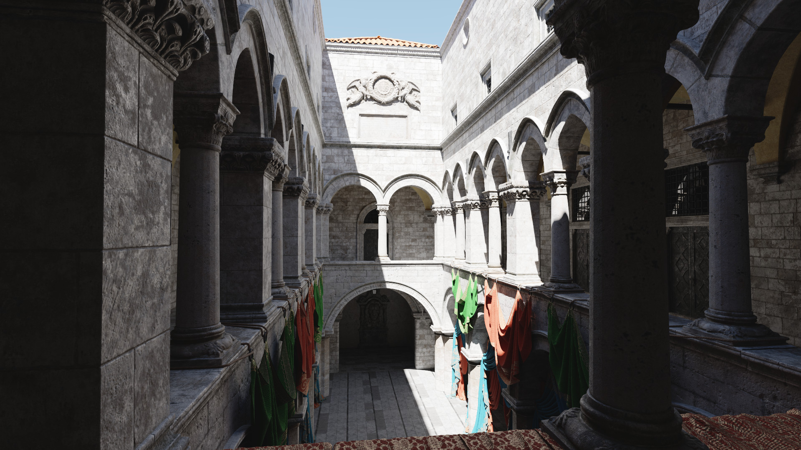

# Ray 

Small pathtracing library created for learning purposes. Essentially a unidirectional pathtracer with NEE and Principled BSDF.
Includes CPU and GPU (Vulkan) backends. Hardware and software raytracing is available with GPU backend.

  - Sample application : <https://github.com/sergcpp/RayDemo>
  - Links to test scenes: https://benedikt-bitterli.me/resources/, https://www.blender.org/download/demo-files/

  

  

  
  

  
  

