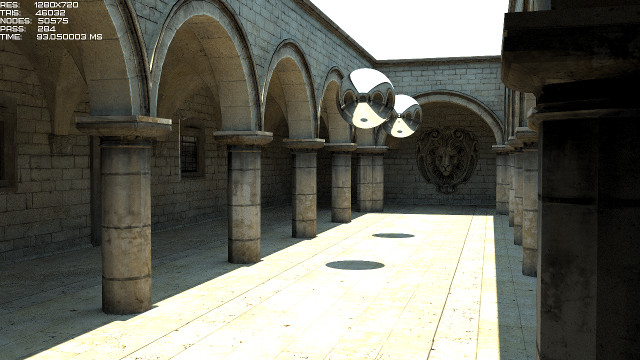
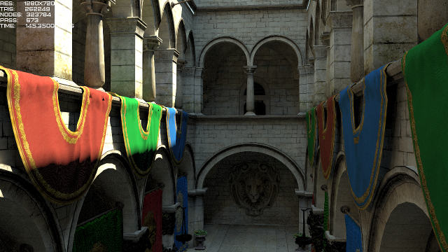
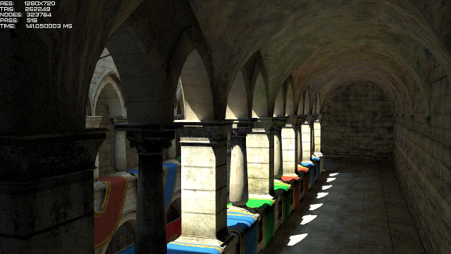

Small pathtracing lib created for learning purposes. Includes CPU and GPU (OpenCL) backends.
~~CPU backends dragging behind and do not include any shading.~~ Its fine now, but should be optimized.

- Full application : https://bitbucket.org/Apfel1994/raydemo
- Video : https://www.youtube.com/watch?v=MHk9jXcdrZs

||
:-------------------------:|:-------------------------:|:-------------------------:

I tried to implement most of the basic features present in 'big' pathtracers:
- Plucker test for intersection with precomputed data per triangle as described in 'Ray-Triangle Intersection Algorithm for Modern CPU Architectures' paper.
- SAH-based BVH with traditional stack- and stackless traversal described in 'Efficient Stack-less BVH Traversal for Ray Tracing' paper. By default traversal with stack is used as it was faster on gpus I tested on. BVH tree is made two-level to support basic rigid motion. Optional 'spatial splits' feature can be used for building better optimized BVH in cost of construction time as described in 'Spatial Splits in Bounding Volume Hierarchies' paper.
- Ray differentials for choosing mip level and filter kernel as described in 'Tracing Ray Differentials' paper.
- Textures are packed in 2d texture array atlas for easier passing to OpenCL kernel.
- Halton sequence is used for sampling.
- CPU backends use 2x2 or 4x2 ray packet traversal optimized with SSE/AVX/NEON intrinsics, thin templated wrapper class (simd_vec_*) used to avoid code duplication, looks still ugly though.
- Compression-sorting-decompression used on secondary rays as described in "Fast Ray Sorting and Breadth-First Packet Traversal for GPU Ray Tracing" paper (only sorting part, no breadth-first traversal used). OpenCL backend uses my terrible implementation of parallel radix sort described in "Introduction to GPU Radix Sort".
- Russian roulette path termination. When ray influence falls certain threshold, path gets randomly terminated by probability inversely proportional to that influence. Weight of non-terminated ray adjusted appropriately.
