# Ray
[](https://github.com/sergcpp/Ray/actions/workflows/ci.yml)

Embeddable cross-platform semi-realtime physically based renderer.

Features:

- Unidirectional pathtracing with NEE and skyportals
- Principled BSDF, filmic tonemapping, physical sky
- Automatic texture compression
- CPU backend accelerated using SSE/AVX/NEON extensions
- GPU backends (Vulkan, DirectX 12) with optional HW raytracing
- DNN denoising (manual port of OpenImageDenoise), accelerated using VK_KHR_cooperative_matrix
- Compatible with Windows (including ARM), Linux, and macOS

<details>
  <summary>Images</summary>

  - Rendered with time limit of 15 seconds using: <https://github.com/sergcpp/RayDemo>
  - Links to the original scenes:  \
    https://benedikt-bitterli.me/resources/  \
    https://www.blender.org/download/demo-files/  \
    https://www.intel.com/content/www/us/en/developer/topic-technology/graphics-research/samples.html  \
    https://developer.nvidia.com/orca/amazon-lumberyard-bistro \
    https://wirewheelsclub.com/models/1965-ford-mustang-fastback \
    https://evermotion.org/shop/show_product/scene-1-ai43-archinteriors-for-blender/14564 \
    https://www.blendermarket.com/products/blender-eevee-modern-villa

  <div>
    <div float="left" >
      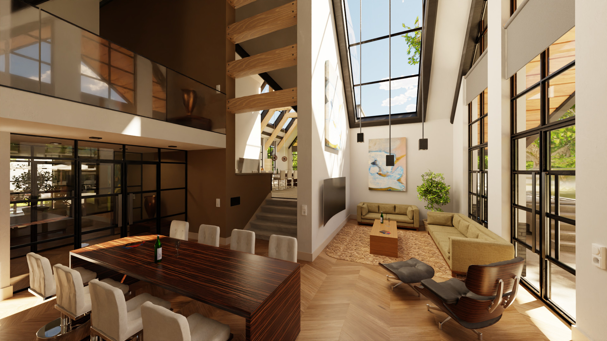
      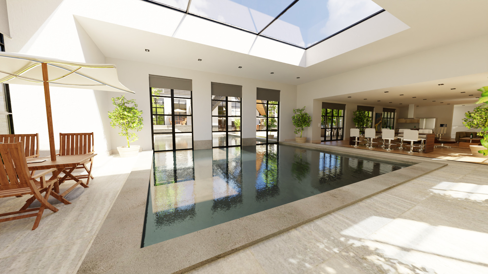
    </div>
    <div float="left" >
      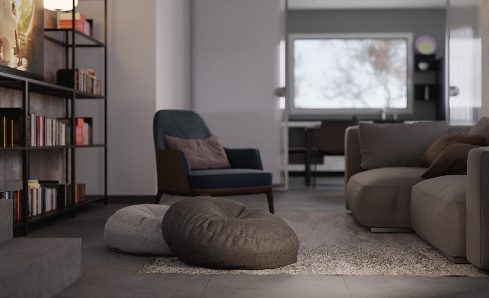
      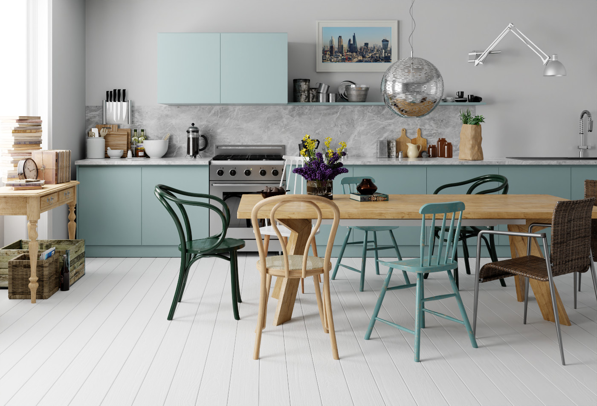
    </div>
    <div float="left" >
      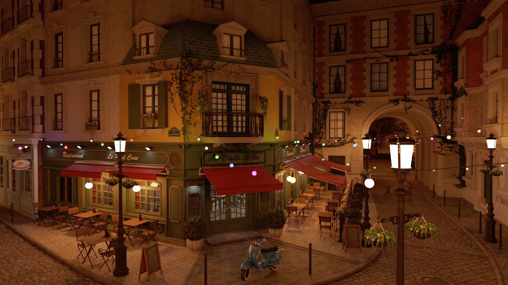
      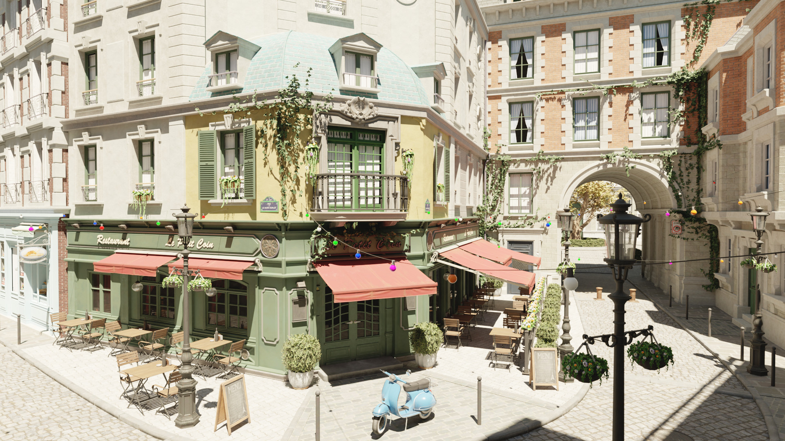
    </div>
    <div float="left" >
      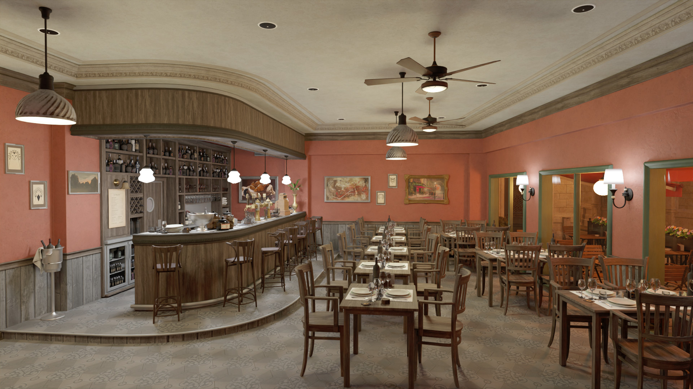
      
    </div>
    <div float="left" >
      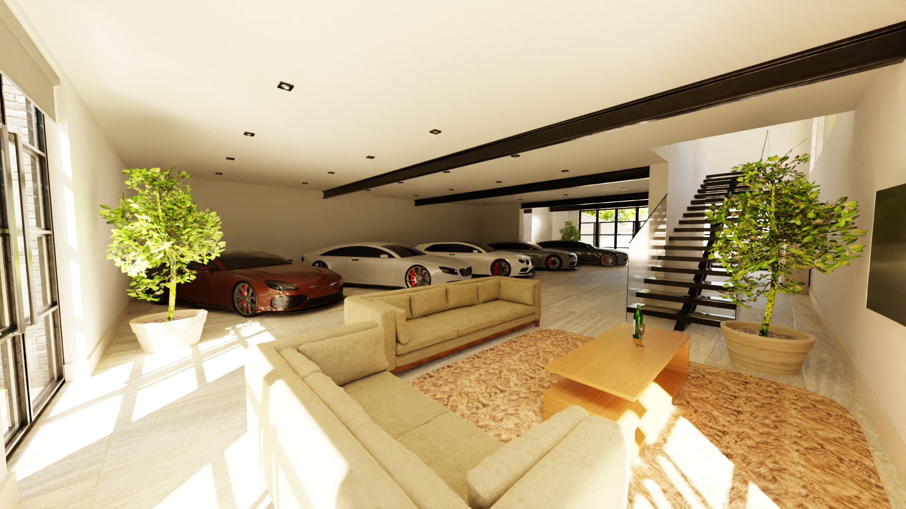
      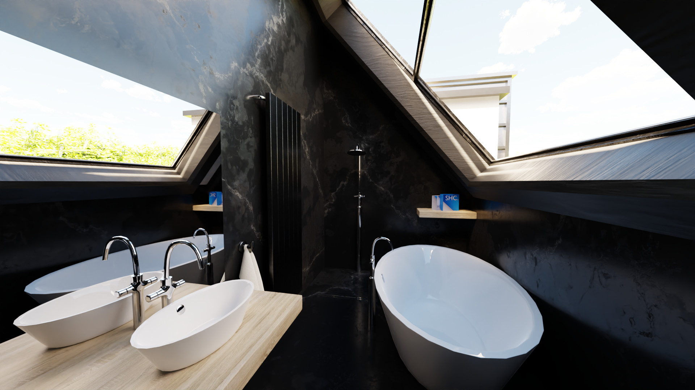
    </div>
    <div float="left" >
      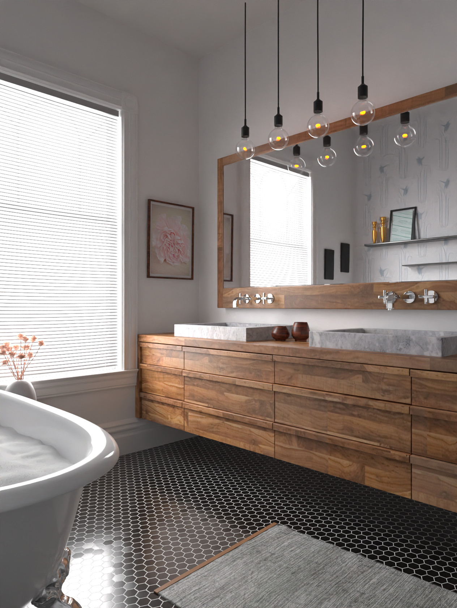
      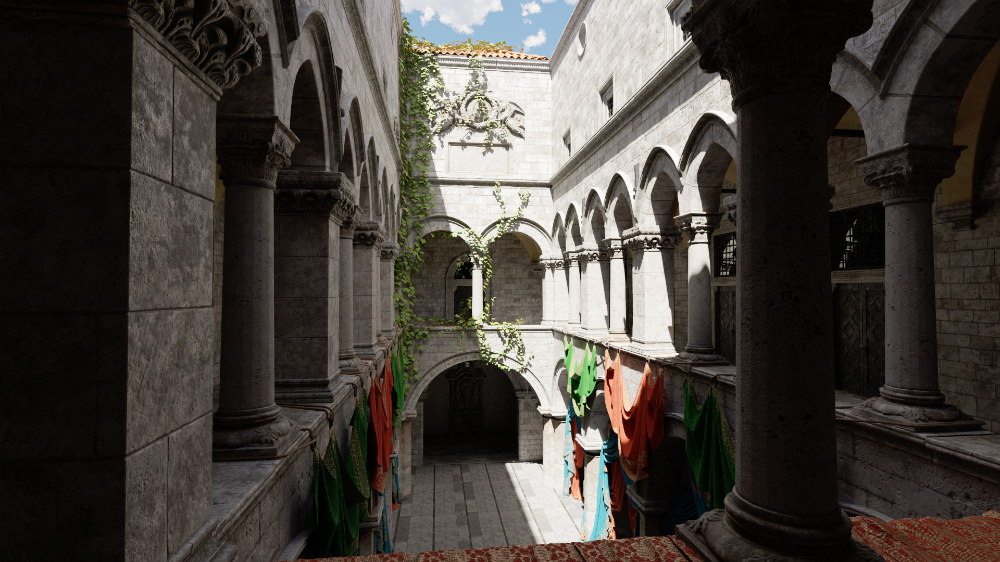
    </div>
    <div float="left" >
      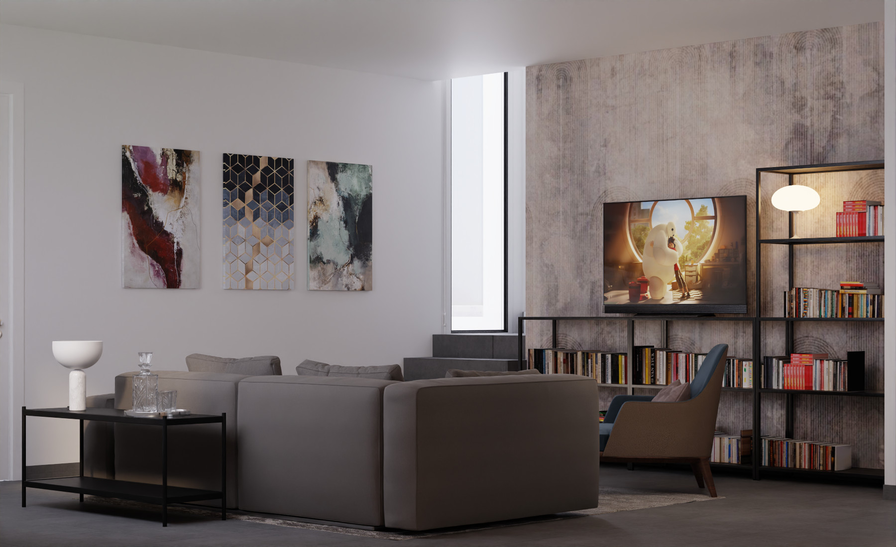
      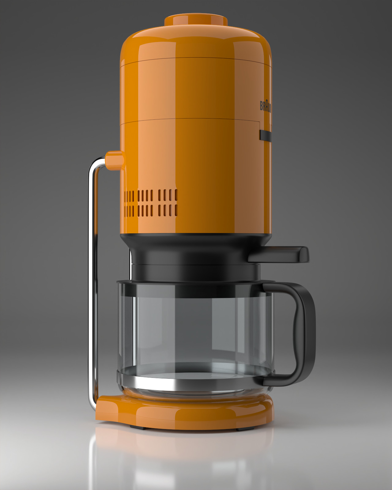
    </div>
    <div float="left" >
      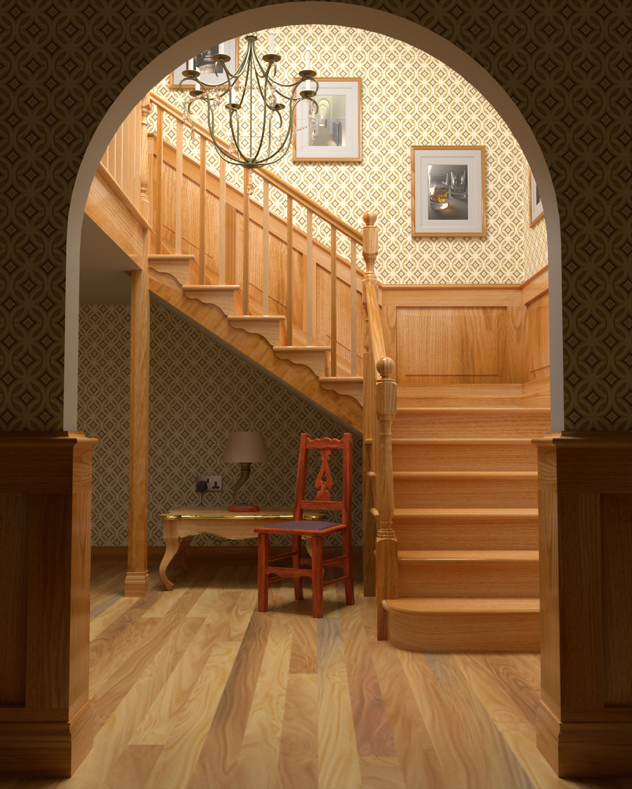
      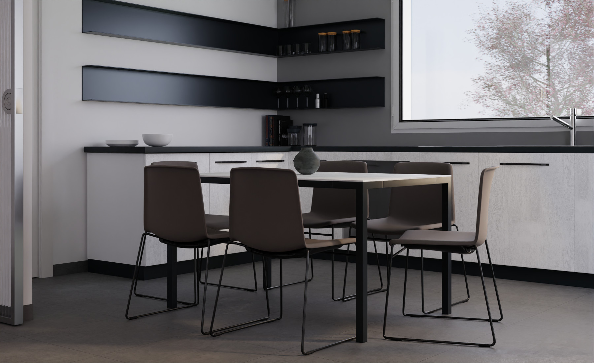
    </div>
    <div float="left" >
      
    </div>
  </div>
</details>

<details>
  <summary>Usage</summary>

  ## Installation
The intended use is to add it as a submodule to an existing project:

```console
git submodule add https://github.com/sergcpp/Ray.git
```

Then in CMakeLists.txt file:

```cmake
add_subdirectory(Ray)
```

But also standalone samples can be compiled and run:

### Windows

```console
git clone https://github.com/sergcpp/Ray.git
cd Ray
mkdir build && cd build/
cmake ..
msbuild ALL_BUILD.vcxproj /p:Configuration=Release
```

### Linux/MacOS

```console
git clone https://github.com/sergcpp/Ray.git
cd Ray
mkdir build && cd build/
cmake .. -DCMAKE_BUILD_TYPE=Release && make
```

## Usage

### Image rendering

```c++
#include <Ray/Ray.h>

int main() {
    const int IMG_W = 256, IMG_H = 256;
    const int SAMPLE_COUNT = 64;

    // Initial frame resolution, can be changed later
    Ray::settings_t s;
    s.w = IMG_W;
    s.h = IMG_H;

    // Additional Ray::eRendererType parameter can be passed (Vulkan GPU renderer created by default)
    Ray::RendererBase *renderer = Ray::CreateRenderer(s, &Ray::g_stdout_log);

    // Each renderer has its own storage implementation (RAM, GPU-RAM),
    // so renderer itself should create scene object
    Ray::SceneBase *scene = renderer->CreateScene();

    // Setup environment
    Ray::environment_desc_t env_desc;
    env_desc.env_col[0] = env_desc.env_col[1] = env_desc.env_col[2] = 0.0f;
    scene->SetEnvironment(env_desc);

    // Add diffuse materials
    Ray::shading_node_desc_t mat_desc1;
    mat_desc1.type = Ray::eShadingNode::Diffuse;
    mat_desc1.base_color[0] = 0.5f;
    mat_desc1.base_color[1] = 0.5f;
    mat_desc1.base_color[2] = 0.5f;
    const Ray::MaterialHandle mat1 = scene->AddMaterial(mat_desc1);

    mat_desc1.base_color[0] = 0.5f;
    mat_desc1.base_color[1] = 0.0f;
    mat_desc1.base_color[2] = 0.0f;
    const Ray::MaterialHandle mat2 = scene->AddMaterial(mat_desc1);

    mat_desc1.base_color[0] = 0.0f;
    mat_desc1.base_color[1] = 0.5f;
    mat_desc1.base_color[2] = 0.0f;
    const Ray::MaterialHandle mat3 = scene->AddMaterial(mat_desc1);

    // Add emissive material
    Ray::shading_node_desc_t mat_desc2;
    mat_desc2.type = Ray::eShadingNode::Emissive;
    mat_desc2.strength = 100.0f;
    mat_desc2.base_color[0] = 1.0f;
    mat_desc2.base_color[1] = 1.0f;
    mat_desc2.base_color[2] = 1.0f;
    mat_desc2.multiple_importance = true; // Use NEE for this lightsource
    const Ray::MaterialHandle mat4 = scene->AddMaterial(mat_desc2);

    // Setup test mesh
    // position(3 floats), normal(3 floats), tex_coord(2 floats)
    // clang-format off
    const float attrs[] = { // floor
                            0.0f, 0.0f, -0.5592f,           0.0f, 1.0f, 0.0f,                   1.0f, 1.0f,
                            0.0f, 0.0f, 0.0f,               0.0f, 1.0f, 0.0f,                   1.0f, 0.0f,
                            -0.5528f, 0.0f, 0.0f,           0.0f, 1.0f, 0.0f,                   0.0f, 0.0f,
                            -0.5496f, 0.0f, -0.5592f,       0.0f, 1.0f, 0.0f,                   0.0f, 1.0f,
                            // back wall
                            0.0f, 0.0f, -0.5592f,           0.0f, 0.0f, 1.0f,                   0.0f, 0.0f,
                            -0.5496f, 0.0f, -0.5592f,       0.0f, 0.0f, 1.0f,                   0.0f, 0.0f,
                            -0.556f, 0.5488f, -0.5592f,     0.0f, 0.0f, 1.0f,                   0.0f, 0.0f,
                            0.0f, 0.5488f, -0.5592f,        0.0f, 0.0f, 1.0f,                   0.0f, 0.0f,
                            // ceiling
                            -0.556f, 0.5488f, -0.5592f,     0.0f, -1.0f, 0.0f,                  0.0f, 0.0f,
                            0.0f, 0.5488f, -0.5592f,        0.0f, -1.0f, 0.0f,                  0.0f, 0.0f,
                            0.0f, 0.5488f, 0.0f,            0.0f, -1.0f, 0.0f,                  0.0f, 0.0f,
                            -0.556f, 0.5488f, 0.0f,         0.0f, -1.0f, 0.0f,                  0.0f, 0.0f,
                            // left wall
                            -0.5528f, 0.0f, 0.0f,           1.0f, 0.0f, 0.0f,                   0.0f, 0.0f,
                            -0.5496f, 0.0f, -0.5592f,       1.0f, 0.0f, 0.0f,                   0.0f, 0.0f,
                            -0.556f, 0.5488f, 0.0f,         1.0f, 0.0f, 0.0f,                   0.0f, 0.0f,
                            -0.556f, 0.5488f, -0.5592f,     1.0f, 0.0f, 0.0f,                   0.0f, 0.0f,
                            // right wall
                            0.0f, 0.0f, -0.5592f,           -1.0f, 0.0f, 0.0f,                  0.0f, 0.0f,
                            0.0f, 0.0f, 0.0f,               -1.0f, 0.0f, 0.0f,                  0.0f, 0.0f,
                            0.0f, 0.5488f, -0.5592f,        -1.0f, 0.0f, 0.0f,                  0.0f, 0.0f,
                            0.0f, 0.5488f, 0.0f,            -1.0f, 0.0f, 0.0f,                  0.0f, 0.0f,
                            // light
                            -0.213f, 0.5478f, -0.227f,      0.0f, -1.0f, 0.0f,                  0.0f, 0.0f,
                            -0.343f, 0.5478f, -0.227f,      0.0f, -1.0f, 0.0f,                  0.0f, 0.0f,
                            -0.343f, 0.5478f, -0.332f,      0.0f, -1.0f, 0.0f,                  0.0f, 0.0f,
                            -0.213f, 0.5478f, -0.332f,      0.0f, -1.0f, 0.0f,                  0.0f, 0.0f,
                            // short block
                            -0.240464f, 0.0f, -0.271646f,   0.285951942f, 0.0f, -0.958243966,   0.0f, 0.0f,
                            -0.240464f, 0.165f, -0.271646f, 0.285951942f, 0.0f, -0.958243966,   0.0f, 0.0f,
                            -0.082354f, 0.165f, -0.224464f, 0.285951942f, 0.0f, -0.958243966,   0.0f, 0.0f,
                            -0.082354f, 0.0f, -0.224464f,   0.285951942f, 0.0f, -0.958243966,   0.0f, 0.0f,
                            -0.240464f, 0.0, -0.271646f,    -0.958243966f, 0.0f, -0.285951942f, 0.0f, 0.0f,
                            -0.240464f, 0.165f, -0.271646f, -0.958243966f, 0.0f, -0.285951942f, 0.0f, 0.0f,
                            -0.287646f, 0.165f, -0.113536f, -0.958243966f, 0.0f, -0.285951942f, 0.0f, 0.0f,
                            -0.287646f, 0.0f, -0.113536f,   -0.958243966f, 0.0f, -0.285951942f, 0.0f, 0.0f,
                            -0.082354f, 0.0f, -0.224464f,   0.958243966f, 0.0f, 0.285951942f,   0.0f, 0.0f,
                            -0.082354f, 0.165f, -0.224464f, 0.958243966f, 0.0f, 0.285951942f,   0.0f, 0.0f,
                            -0.129536f, 0.165f, -0.066354f, 0.958243966f, 0.0f, 0.285951942f,   0.0f, 0.0f,
                            -0.129536f, 0.0f, -0.066354f,   0.958243966f, 0.0f, 0.285951942f,   0.0f, 0.0f,
                            -0.287646f, 0.0f, -0.113536f,   -0.285951942f, 0.0f, 0.958243966,   0.0f, 0.0f,
                            -0.287646f, 0.165f, -0.113536f, -0.285951942f, 0.0f, 0.958243966,   0.0f, 0.0f,
                            -0.129536f, 0.165f, -0.066354f, -0.285951942f, 0.0f, 0.958243966,   0.0f, 0.0f,
                            -0.129536f, 0.0f, -0.066354f,   -0.285951942f, 0.0f, 0.958243966,   0.0f, 0.0f,
                            -0.240464f, 0.165f, -0.271646f, 0.0f, 1.0f, 0.0f,                   0.0f, 0.0f,
                            -0.082354f, 0.165f, -0.224464f, 0.0f, 1.0f, 0.0f,                   0.0f, 0.0f,
                            -0.129536f, 0.165f, -0.066354f, 0.0f, 1.0f, 0.0f,                   0.0f, 0.0f,
                            -0.287646f, 0.165f, -0.113536f, 0.0f, 1.0f, 0.0f,                   0.0f, 0.0f,
                            // tall block
                            -0.471239f, 0.0f, -0.405353f,   -0.296278358f, 0.0f, -0.955101609f, 0.0f, 0.0f,
                            -0.471239f, 0.33f, -0.405353f,  -0.296278358f, 0.0f, -0.955101609f, 0.0f, 0.0f,
                            -0.313647f, 0.33f, -0.454239f,  -0.296278358f, 0.0f, -0.955101609f, 0.0f, 0.0f,
                            -0.313647f, 0.0f, -0.454239f,   -0.296278358f, 0.0f, -0.955101609f, 0.0f, 0.0f,
                            -0.264761f, 0.0f, -0.296647f,   0.955101609f, 0.0f, -0.296278358f,  0.0f, 0.0f,
                            -0.264761f, 0.33f, -0.296647f,  0.955101609f, 0.0f, -0.296278358f,  0.0f, 0.0f,
                            -0.313647f, 0.33f, -0.454239f,  0.955101609f, 0.0f, -0.296278358f,  0.0f, 0.0f,
                            -0.313647f, 0.0f, -0.454239f,   0.955101609f, 0.0f, -0.296278358f,  0.0f, 0.0f,
                            -0.471239f, 0.0f, -0.405353f,   -0.955101609f, 0.0f, 0.296278358f,  0.0f, 0.0f,
                            -0.471239f, 0.33f, -0.405353f,  -0.955101609f, 0.0f, 0.296278358f,  0.0f, 0.0f,
                            -0.422353f, 0.33f, -0.247761f,  -0.955101609f, 0.0f, 0.296278358f,  0.0f, 0.0f,
                            -0.422353f, 0.0f, -0.247761f,   -0.955101609f, 0.0f, 0.296278358f,  0.0f, 0.0f,
                            -0.422353f, 0.0f, -0.247761f,   0.296278358f, 0.0f, 0.955101609f,   0.0f, 0.0f,
                            -0.422353f, 0.33f, -0.247761f,  0.296278358f, 0.0f, 0.955101609f,   0.0f, 0.0f,
                            -0.264761f, 0.33f, -0.296647f,  0.296278358f, 0.0f, 0.955101609f,   0.0f, 0.0f,
                            -0.264761f, 0.0f, -0.296647f,   0.296278358f, 0.0f, 0.955101609f,   0.0f, 0.0f,
                            -0.471239f, 0.33f, -0.405353f,  0.0f, 1.0f, 0.0f,                   0.0f, 0.0f,
                            -0.313647f, 0.33f, -0.454239f,  0.0f, 1.0f, 0.0f,                   0.0f, 0.0f,
                            -0.264761f, 0.33f, -0.296647f,  0.0f, 1.0f, 0.0f,                   0.0f, 0.0f,
                            -0.422353f, 0.33f, -0.247761f,  0.0f, 1.0f, 0.0f,                   0.0f, 0.0f};
    const uint32_t indices[] = { 0, 2, 1, 0, 3, 2,
                                4, 6, 5, 4, 7, 6,
                                8, 9, 10, 8, 10, 11,
                                12, 13, 14, 13, 15, 14,
                                16, 17, 18, 18, 17, 19,
                                20, 21, 22, 20, 22, 23,
                                24, 25, 26, 24, 26, 27,
                                28, 30, 29, 28, 31, 30,
                                32, 33, 34, 32, 34, 35,
                                36, 38, 37, 36, 39, 38,
                                40, 42, 41, 40, 43, 42,
                                44, 45, 46, 44, 46, 47,
                                48, 50, 49, 48, 51, 50,
                                52, 54, 53, 52, 55, 54,
                                56, 58, 57, 56, 59, 58,
                                60, 62, 61, 60, 63, 62};
    // clang-format on

    Ray::mesh_desc_t mesh_desc;
    mesh_desc.prim_type = Ray::ePrimType::TriangleList;
    mesh_desc.vtx_positions = {attrs, 0, 8};
    mesh_desc.vtx_normals = {attrs, 3, 8};
    mesh_desc.vtx_uvs = {attrs, 6, 8};
    mesh_desc.vtx_indices = indices;

    // Setup material groups
    const Ray::mat_group_desc_t groups[] = {
        {mat1, 0, 18}, {mat2, 19, 6}, {mat3, 25, 6}, {mat4, Ray::InvalidMaterialHandle, 31, 6}, {mat1, 37, 60}};
    mesh_desc.groups = groups;

    Ray::MeshHandle mesh1 = scene->AddMesh(mesh_desc);

    // Instantiate mesh
    const float xform[] = {1.0f, 0.0f, 0.0f, 0.0f, //
                           0.0f, 1.0f, 0.0f, 0.0f, //
                           0.0f, 0.0f, 1.0f, 0.0f, //
                           0.0f, 0.0f, 0.0f, 1.0f};
    scene->AddMeshInstance(mesh1, xform);

    // Add camera
    const float view_origin[] = {-0.278f, 0.273f, 0.8f};
    const float view_dir[] = {0.0f, 0.0f, -1.0f};

    Ray::camera_desc_t cam_desc;
    cam_desc.type = Ray::eCamType::Persp;
    memcpy(&cam_desc.origin[0], &view_origin[0], 3 * sizeof(float));
    memcpy(&cam_desc.fwd[0], &view_dir[0], 3 * sizeof(float));
    cam_desc.fov = 39.1463f;

    const Ray::CameraHandle cam = scene->AddCamera(cam_desc);
    scene->set_current_cam(cam);

    scene->Finalize();

    // Create region contex for frame, setup to use whole frame
    auto region = Ray::RegionContext{{0, 0, IMG_W, IMG_H}};

    // Render image
    for (int i = 0; i < SAMPLE_COUNT; i++) {
        // Each call performs one iteration, blocks until finished
        renderer->RenderScene(scene, region);
        printf("Renderered %i samples\n", i);
    }
    printf("Done\n");

    // Get rendered image pixels in 32-bit floating point RGBA format
    const Ray::color_data_rgba_t pixels = renderer->get_pixels_ref();

    for (int y = 0; y < IMG_H; y++) {
        for (int x = 0; x < IMG_W; x++) {
            int i = y * pixels.pitch + x;
            const Ray::color_rgba_t &p = pixels.ptr[i];

            float red = p.v[0];
            float green = p.v[1];
            float blue = p.v[2];
            float alpha = p.v[3];

            // ...
            // Save pixels or convert to desired format
            // ...
        }
    }

    delete scene;
    delete renderer;
}
```

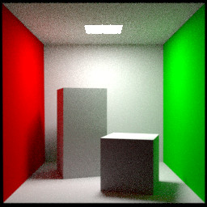

### Multithreading

With CPU backends it is safe to call RenderScene from different threads for non-overlaping image regions:

```c++
...
    if (Ray::RendererSupportsMultithreading(renderer->type())) {
        // Split image into 4 regions
        Ray::RegionContext regions[] = { Ray::RegionContext{ { 0,       0,       IMG_W/2, IMG_H/2 } },
                                         Ray::RegionContext{ { IMG_W/2, 0,       IMG_W/2, IMG_H/2 } },
                                         Ray::RegionContext{ { 0,       IMG_H/2, IMG_W/2, IMG_H/2 } },
                                         Ray::RegionContext{ { IMG_W/2, IMG_H/2, IMG_W/2, IMG_H/2 } } };

        #pragma omp parallel for
        for (int i = 0; i < 4; i++) {
            for (int j = 0; j < SAMPLE_COUNT; j++) {
                renderer->RenderScene(scene, regions[i]);
            }
        }
    }
...
```

### Denoising

The image can be denoised either with UNet (slower) or NLM filter (faster).

```c++
...
  if (EnableHighQualityDenoising) {
      // Initialize neural denoiser
      Ray::unet_filter_properties_t unet_props;
      renderer->InitUNetFilter(true, unet_props);

      for (int pass = 0; pass < unet_props.pass_count; ++pass) {
          renderer->DenoiseImage(pass, region);
      }
  } else {
      // Run simple NLM filter
      renderer->DenoiseImage(region);
  }
...
```

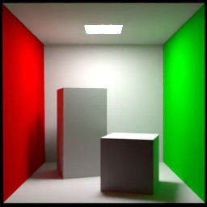

See [samples](samples) folder for more.
</details>


