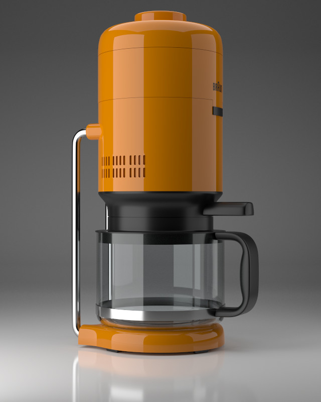
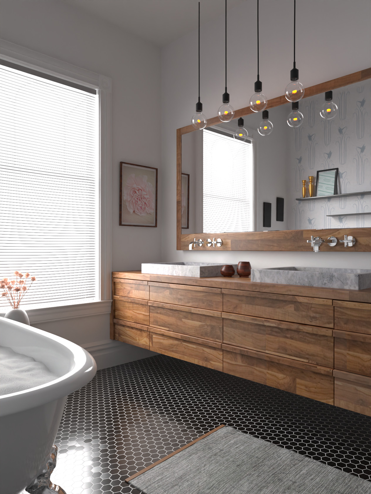

# Ray [](https://gitlab.com/sergcpp/Ray/-/commits/master)

Small pathtracing library created for learning purposes. Includes CPU and GPU (Vulkan) backends.

  - Full application : <https://github.com/sergcpp/RayDemo>
  - Video : <https://www.youtube.com/watch?v=MHk9jXcdrZs>

<div>
<div float="left" >
  
  
</div>
<div float="left">
  
</div>
</div>

(Scenes are taken from here: <https://benedikt-bitterli.me/resources/>)

## Installation
The intended use is to add it as a submodule to an existing project:
```console
$ git submodule add https://github.com/sergcpp/Ray.git
```
Then in CMakeLists.txt file:
```cmake
add_subdirectory(Ray)
```
But also standalone test can be compiled and run:
### Windows
```console
$ git clone https://github.com/sergcpp/Ray.git
$ cd Ray
$ mkdir build && cd build/
$ cmake ..
$ msbuild ALL_BUILD.vcxproj /p:Configuration=Release
$ tests/Release/test_Ray.exe
```
### Linux/MacOS
Either OpenCL should be installed on the system or -DENABLE_OPENCL=OFF flag should be passed to cmake.
```console
$ git clone https://github.com/sergcpp/Ray.git
$ cd Ray
$ mkdir build && cd build/
$ cmake .. -DCMAKE_BUILD_TYPE=Release && make
$ ./tests/test_Ray
```
### Android
Status of OpenCL on Android is still unclear and seems like it only works on a small number of devices, so OpenCL backend is disabled by default.
But library includes reference and NEON implementations, which work on Android. For compilation Android NDK tools are needed.
For details about compilation with cmake and ninja please see: <https://github.com/sergcpp/DummyEngine/blob/master/build_android.py>

## Usage
### Image rendering
```c++
#include <Ray/RendererFactory.h>

int main() {
    const int IMG_W = 256, IMG_H = 256;
    const int SAMPLE_COUNT = 512;

    // Initial frame resolution, can be changed later (obviously)
    Ray::settings_t s;
    s.w = IMG_W;
    s.h = IMG_H;

    // Additional Ray::eRendererType parameter can be passed (OpenCL-GPU renderer created by default)
    auto renderer = Ray::CreateRenderer(s);

    // Each renderer has its own storage implementation (RAM, GPU-RAM),
    // so renderer itself should create scene object
    auto scene = renderer->CreateScene();

    // Setup environment
    Ray::environment_desc_t env_desc;
    env_desc.env_col[0] = env_desc.env_col[1] = env_desc.env_col[2] = 0.0f;
    scene->SetEnvironment(env_desc);

    // Add white texture
    const Ray::pixel_color8_t white = { 200, 200, 200, 255 };
    Ray::tex_desc_t tex_desc;
    tex_desc.w = 1;
    tex_desc.h = 1;
    tex_desc.generate_mipmaps = false;
    tex_desc.data = &white;

    uint32_t tex_id = scene->AddTexture(tex_desc);

    // Add diffuse material
    Ray::mat_desc_t mat_desc1;
    mat_desc1.type = Ray::DiffuseMaterial;
    mat_desc1.main_color[0] = mat_desc1.main_color[1] = mat_desc1.main_color[2] = 1.0f;
    mat_desc1.main_texture = tex_id;

    uint32_t mat1_id = scene->AddMaterial(mat_desc1);

    // Add emissive materials
    Ray::mat_desc_t mat_desc2;
    mat_desc2.type = Ray::EmissiveMaterial;
    mat_desc2.strength = 4.0f;
    mat_desc2.main_color[0] = 1.0f;
    mat_desc2.main_color[1] = 0.0f;
    mat_desc2.main_color[2] = 0.0f;
    mat_desc2.main_texture = tex_id;

    uint32_t mat2_id = scene->AddMaterial(mat_desc2);

    mat_desc2.main_color[0] = 0.0f;
    mat_desc2.main_color[1] = 1.0f;
    uint32_t mat3_id = scene->AddMaterial(mat_desc2);

    mat_desc2.main_color[1] = 0.0f;
    mat_desc2.main_color[2] = 1.0f;
    uint32_t mat4_id = scene->AddMaterial(mat_desc2);

    // Setup test mesh
    // Attribute layout is controlled by Ray::eVertexLayout enums
    // Is this example(PxyzNxyzTuv): position(3 floats), normal(3 floats), tex_coord(2 floats)
    const float attrs[] = { -1.0f, 0.0f, -1.0f,     0.0f, 1.0f, 0.0f,   1.0f, 0.0f,
                            1.0f, 0.0f, -1.0f,      0.0f, 1.0f, 0.0f,   0.0f, 0.0f,
                            1.0f, 0.0f, 1.0f,       0.0f, 1.0f, 0.0f,   0.0f, 1.0f,
                            -1.0f, 0.0f, 1.0f,      0.0f, 1.0f, 0.0f,   1.0f, 1.0f,

                            -1.0f, 0.5f, -1.0f,     0.0f, 1.0f, 0.0f,   1.0f, 1.0f,
                            -0.33f, 0.5f, -1.0f,    0.0f, 1.0f, 0.0f,   1.0f, 1.0f,
                            -0.33f, 0.0f, -1.0f,    0.0f, 1.0f, 0.0f,   1.0f, 1.0f,
                            0.33f, 0.5f, -1.0f,     0.0f, 1.0f, 0.0f,   0.0f, 0.0f,
                            0.33f, 0.0f, -1.0f,     0.0f, 1.0f, 0.0f,   0.0f, 0.0f,
                            1.0f, 0.5f, -1.0f,      0.0f, 1.0f, 0.0f,   0.0f, 0.0f };
    const uint32_t indices[] = { 0, 2, 1, 0, 3, 2,
                                 0, 5, 4, 6, 5, 0,
                                 5, 6, 7, 7, 6, 8,
                                 7, 8, 9, 8, 1, 9 };

    Ray::mesh_desc_t mesh_desc;
    mesh_desc.prim_type = Ray::TriangleList;
    mesh_desc.layout = Ray::PxyzNxyzTuv;
    mesh_desc.vtx_attrs = &attrs[0];
    mesh_desc.vtx_attrs_count = 10;
    mesh_desc.vtx_indices = &indices[0];
    mesh_desc.vtx_indices_count = 24;

    // Setup material groups
    mesh_desc.shapes.push_back({ mat1_id, 0, 6 });
    mesh_desc.shapes.push_back({ mat2_id, 6, 6 });
    mesh_desc.shapes.push_back({ mat3_id, 12, 6 });
    mesh_desc.shapes.push_back({ mat4_id, 18, 6 });

    uint32_t mesh1_id = scene->AddMesh(mesh_desc);

    // Instantiate mesh
    const float xform[] = { 1.0f, 0.0f, 0.0f, 0.0f,
                            0.0f, 1.0f, 0.0f, 0.0f,
                            0.0f, 0.0f, 1.0f, 0.0f,
                            0.0f, 0.0f, 0.0f, 1.0f };
    uint32_t inst_id = scene->AddMeshInstance(mesh1_id, xform);

    // Add camera
    const float view_origin[] = { 2.0f, 2.0f, 2.0f };
    const float view_dir[] = { -0.577f, -0.577f, -0.577f };

    Ray::camera_desc_t cam_desc;
    cam_desc.type = Ray::Persp;
    cam_desc.filter = Ray::Tent;
    memcpy(&cam_desc.origin[0], &view_origin[0], 3 * sizeof(float));
    memcpy(&cam_desc.fwd[0], &view_dir[0], 3 * sizeof(float));
    cam_desc.fov = 45.0f;
    cam_desc.gamma = 2.2f;

    uint32_t cam_id = scene->AddCamera(cam_desc);
    scene->set_current_cam(cam_id);

    // Create region contex for frame, setup to use whole frame
    auto region = Ray::RegionContext{ { 0, 0, IMG_W, IMG_H } };

    // Render image
    for (int i = 0; i < SAMPLE_COUNT; i++) {
        // Each call performs one iteration, blocks until finished
        renderer->RenderScene(scene, region);
    }

    // Get rendered image pixels in 32-bit floating point RGBA format
    const auto *pixels = renderer->get_pixels_ref();

    for (int y = 0; y < IMG_H; y++) {
        for (int x = 0; x < IMG_W; x++) {
            int i = y * IMG_W + x;
            const auto &p = pixels[i];

            float red = p.r;
            float green = p.g;
            float blue = p.b;
            float alpha = p.a;

            // ...
            // Save pixels or convert to desired format
            // ...
        }
    }
}
```


### Multithreading
With CPU backends it is safe to call RenderScene from different threads for non-overlaping image regions:
```c++
...
    // Split image into 4 regions
    Ray::RegionContext regions[] = { Ray::RegionContext{ { 0,       0,       IMG_W/2, IMG_H/2 } },
                                     Ray::RegionContext{ { IMG_W/2, 0,       IMG_W/2, IMG_H/2 } },
                                     Ray::RegionContext{ { 0,       IMG_H/2, IMG_W/2, IMG_H/2 } },
                                     Ray::RegionContext{ { IMG_W/2, IMG_H/2, IMG_W/2, IMG_H/2 } } };

    #pragma omp parallel for
    for (int i = 0; i < 4; i++) {
        for (int j = 0; j < SAMPLE_COUNT; j++) {
            renderer->RenderScene(scene, regions[i]);
        }
    }
...
```

### Lightmap generation
Lightmapping is done through special 'geometric' camera type:
```c++
...
    // Add camera for lightmapping
    Ray::camera_desc_t cam_desc;
    cam_desc.type = Ray::Geo;
    cam_desc.mi_index = inst_id;    // mesh instance id returned from scene->AddMeshInstance(...)
    cam_desc.uv_index = 0;          // index of uv layer used for lightmap texture
    cam_desc.lighting_only = true;  // include only light contribution (no albedo)
    cam_desc.skip_direct_lighting = true;   // exclude direct lights contribution from lightmap
    cam_desc.no_background = true;  // use transparent background
    cam_desc.gamma = 2.2f;
    cam_desc.output_sh = true;      // output spherical harmonics coeffs in addition to color map

    uint32_t cam_id = scene->AddCamera(cam_desc);
    scene->set_current_cam(cam_id);
...
```


With 'output_sh' set to true renderer additionally outputs lightmap in 2-band (4 coeffitients per color channel - 12 total) spherical harmonics representation:
```c++
...
    const auto *sh_data = renderer->get_sh_data_ref();

    for (int y = 0; y < IMG_H; y++) {
        for (int x = 0; x < IMG_W; x++) {
            int i = y * IMG_W + x;
            const auto &sh = sh_data[i];

            const float SH_A0 = 0.886226952f; // PI / sqrt(4.0f * Pi)
            const float SH_A1 = 1.02332675f;  // sqrt(PI / 3.0f)

            // Apply diffuse convolution (for example)
            float L00_r = sh.coeff_r[0] * SH_A0;
            float L10_r = sh.coeff_r[1] * SH_A1;
            float L11_r = sh.coeff_r[2] * SH_A1;
            float L12_r = sh.coeff_r[3] * SH_A1;

            float L00_g = sh.coeff_g[0] * SH_A0;
            ...

            // Save or convert to different representation
        }
    }
...
```

## Implementation details

  - Ray/triangle intersection is done using Plucker test with help of precomputed data stored per triangle as described in 'Ray-Triangle Intersection Algorithm for Modern CPU Architectures' paper.
  - SAH-based binary BVH is used as acceleration structure. Two traversal algorithms are available: stack- and stackless (described in 'Efficient Stack-less BVH Traversal for Ray Tracing' paper). By default traversal with stack is used as it was faster on gpus I tested on. BVH tree is made two-level to support basic rigid motion. Optional 'spatial splits' feature can be used for building better optimized BVH in cost of construction time as described in 'Spatial Splits in Bounding Volume Hierarchies' paper. Also optional hlbvh can be used, which builds tree faster but with less quality.
  - Textures (with mip maps) are packed into a 2d texture array atlas for easier passing to OpenCL kernel.
  - Ray differentials are used for choosing mip level and filter kernel size as described in 'Tracing Ray Differentials' paper.
  - Sampling is done using Halton sequence with per pixel randomization.
  - CPU backend can use either packets or single rays with wide BVH tree. Both variants are optimized with SSE/AVX/NEON intrinsics. Thin templated wrapper class (simd_vec_*) used to avoid code duplication, looks still ugly though.
  - To increase ray coherency compression-sorting-decompression used on secondary rays as described in "Fast Ray Sorting and Breadth-First Packet Traversal for GPU Ray Tracing" paper (only sorting part, no breadth-first traversal used). OpenCL backend uses implementation of parallel radix sort described in "Introduction to GPU Radix Sort".
  - Punctual light sources organized in separate BVH tree to accelerate light culling.
  - (Random path termination) When Ray influence falls certain threshold, path gets randomly terminated by probability inversely proportional to that influence. Weight of non-terminated Ray adjusted appropriately.
  - (Lightmapping) Special 'Geo' camera type can be used for sampling meshes in texture space to produce direct and indirect lightmaps for realtime rendering. Simple color map and 2-band spherical harmonics representation available as output. Latter can be used for creating lightmaps that interact with surface normal maps.

